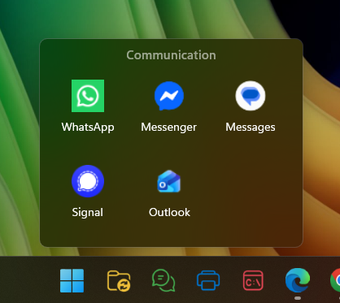
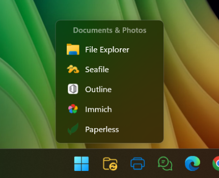
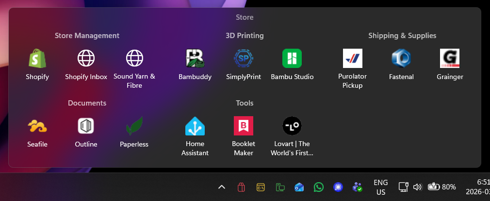
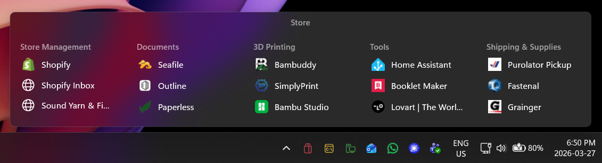
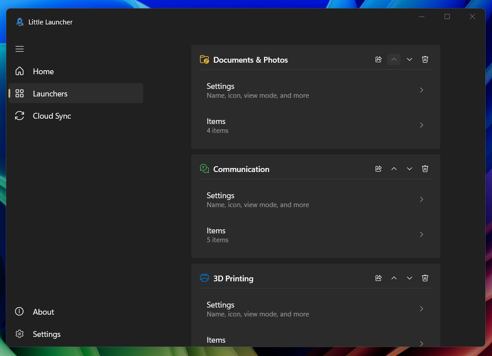
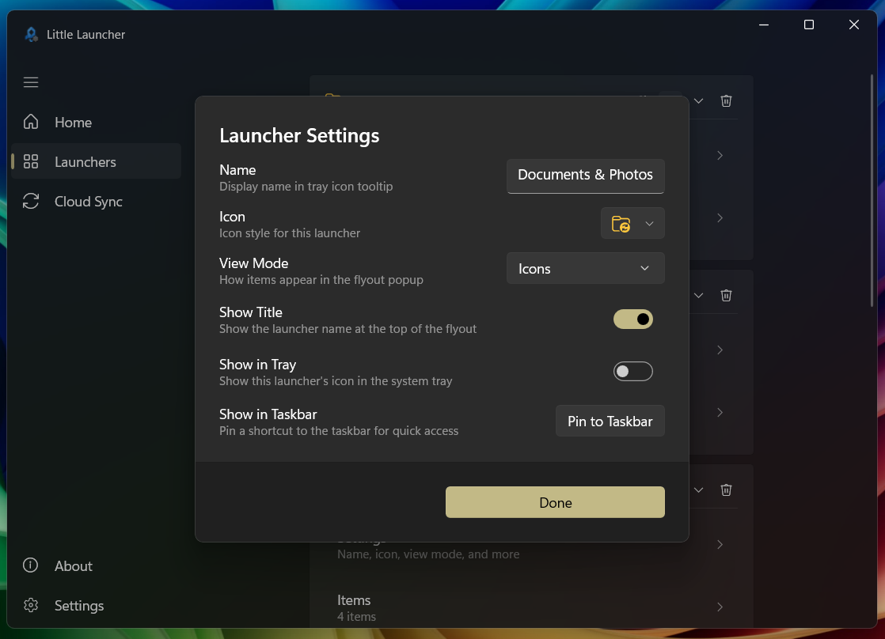
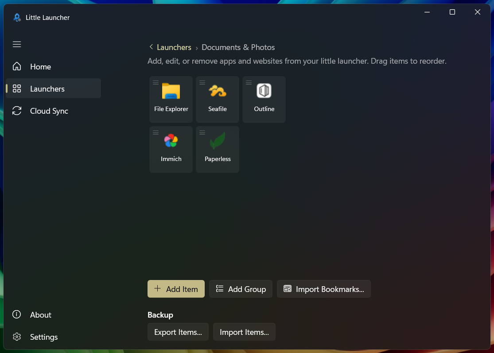
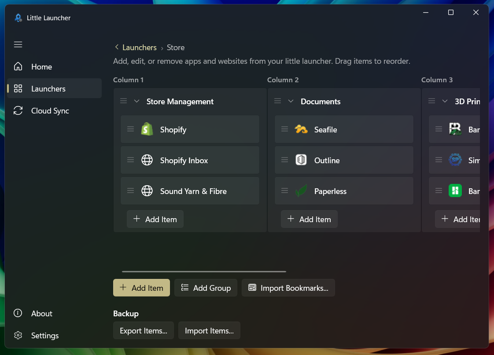

<p align="center">
  
</p>

<h1 align="center">Little Launcher</h1>

<p align="center">
  A Windows launcher with system-tray and taskbar icon support, settings-sync capability, built with WinUI 3, Windows App SDK, and SSH/SFTP.
</p>

<p align="center">
  &nbsp;
  &nbsp;
  &nbsp;
  &nbsp;
  &nbsp;
  
</p>

<p align="center">
  
  &nbsp;&nbsp;
  
</p>

<p align="center">
  
</p>

<p align="center">
  
</p>

<p align="center">
  
</p>

<p align="center">
  
</p>

<p align="center">
  
</p>

<p align="center">
  
</p>

## Overview

Little Launcher lives in the Windows system tray and/or taskbar. Clicking its icon opens a flyout with app and website shortcuts. It also provides SSH/SFTP-based settings synchronisation so you can keep your launcher configuration in sync across machines.

**Key features:**

- **Multiple launchers** — define multiple named launchers, each with its own icon and items.
- **Application & website shortcuts** — launch any executable or URL with one click from the flyout.
- **View modes** — choose between list view (icon + name) or icon grid view for each launcher.
- **Groups & columns** — organise items into groups and multi-column layouts.
- **System-tray icons** — a tray icon that opens a flyout popup for shortcuts.
- **Taskbar icons** — a companion helper exe (`LauncherShortcut`) can be pinned to the taskbar so one click opens the flyout without needing to find the tray icon.
- **SSH/SFTP settings sync** — upload/download all launchers to a remote server using SSH.NET.
- **Shared launchers** — share individual launchers via local/network files or per-launcher SFTP. Owners publish items; subscribers receive read-only copies.
- **Export & import** — back up and restore items locally via JSON.
- **Bookmark import** — import bookmarks directly from Chrome, Edge, Firefox, or any browser's exported HTML bookmarks file into a launcher.

## Architecture

| Layer | Description |
|---|---|
| `MainWindow` | Invisible host window. Owns the system-tray icon (`H.NotifyIcon`). Enforces single-instance via Mutex. Cross-process IPC via registered window messages. |
| `FlyoutWindow` | A popup window that displays launcher items in list or icon grid view, positioned above the taskbar. Dismissed on focus loss or Escape. |
| `SettingsWindow` | WinUI 3 window with `MicaBackdrop` and `NavigationView` — pages for Home, Launchers, Launcher Items, Cloud Sync, Settings, and About. |
| `SftpSyncService` | Static async methods for upload/download/test-connection using SSH.NET (`Renci.SshNet`). Also handles per-launcher shared sync (file or SFTP). Supports private-key and password auth. |
| `AutoSyncService` | Manages automatic sync: startup download, debounced upload, periodic download, and shared launcher sync. |
| `SettingsManager` | Fully static. Serialises `UserSettings` to `%AppData%\LittleLauncher\settings.json` via `System.Text.Json`. Migrates from legacy `settings.xml` on first load. |
| `ThemeManager` | Sets `RequestedTheme` on root `FrameworkElement` of each window. Detects system dark/light mode via cached `UISettings`. |

## Tech stack

| Package | Version | Purpose |
|---|---|---|
| [Windows App SDK](https://github.com/microsoft/WindowsAppSDK) | 1.8.260209005 | WinUI 3 controls, Mica, NavigationView |
| [H.NotifyIcon.WinUI](https://github.com/HavenDV/H.NotifyIcon) | 2.4.1 | System tray icon |
| [CommunityToolkit.Mvvm](https://github.com/CommunityToolkit/dotnet) | 8.4.0 | Source-gen `[ObservableProperty]`, `RelayCommand` |
| [SSH.NET](https://github.com/sshnet/SSH.NET) | 2025.1.0 | SFTP sync |
| [NLog](https://nlog-project.org/) | 6.1.1 | Logging |

**Target:** .NET 10, `net10.0-windows10.0.22000.0`, unpackaged (`WindowsPackageType=None`), platforms `x64` and `ARM64`.

## Getting started

### Prerequisites

- Windows 10/11 (build 22000+)
- [.NET 10 SDK](https://dotnet.microsoft.com/download/dotnet/10.0)

### Build

```bash
cd LittleLauncher
dotnet build -c Debug
```

`Directory.Build.props` auto-detects the platform from `PROCESSOR_ARCHITECTURE` (ARM64 → ARM64, otherwise x64). To override: `-p:Platform=x64` or `-p:Platform=ARM64`.

### Run

```bash
dotnet run --project LittleLauncher -c Debug
```

Or open `LittleLauncher.sln` in Visual Studio / Rider and press F5.

## Project structure

```
LittleLauncher/              # WinUI 3 application project
├── App.xaml / App.xaml.cs     # Bootstrap, exception handling, settings restore
├── MainWindow.xaml/.cs        # Invisible host + tray icon + singleton IPC
├── SettingsWindow.xaml/.cs    # WinUI 3 settings UI with Mica backdrop
├── Classes/
│   ├── NativeMethods.cs       # P/Invoke declarations (user32, dwmapi, shcore, comctl32, shlwapi)
│   ├── ThemeManager.cs        # Theme orchestration (ElementTheme)
│   └── Settings/
│       └── SettingsManager.cs # JSON serialisation (fully static)
├── Models/
│   ├── LauncherItem.cs
│   ├── Launcher.cs            # Multi-launcher model with sharing properties
│   └── SshConnectionProfile.cs
├── Pages/
│   ├── HomePage.xaml/.cs
│   ├── LaunchersPage.xaml/.cs  # Launcher card management + sharing UI
│   ├── LauncherItemsPage.xaml/.cs # Per-launcher item editing (read-only for subscribers)
│   ├── SyncPage.xaml/.cs
│   ├── SystemPage.xaml/.cs
│   └── AboutPage.xaml/.cs
├── Services/
│   ├── AutoSyncService.cs     # Automatic sync triggers
│   ├── FaviconService.cs      # Website favicon & title fetching
│   ├── SftpSyncService.cs     # SSH/SFTP upload/download/test + shared sync
│   └── UpdateService.cs       # Update checking
├── ViewModels/
│   └── UserSettings.cs        # Observable settings (CommunityToolkit.Mvvm)
├── Windows/
│   └── FlyoutWindow.xaml/.cs   # Launcher flyout popup
└── Resources/
    ├── Localization/
    │   └── Dictionary-en-US.xaml
    └── LittleLauncher.ico

LauncherShortcut/              # Companion console exe for pin-to-taskbar helper
```

## License

This project is licensed under the GPL-3.0 License. See [LICENSE](LICENSE) for details.
